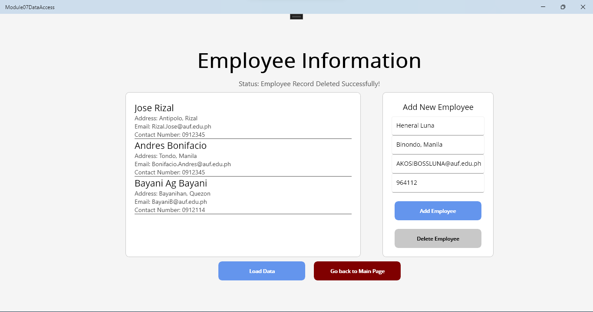

# Module 05 - Exercise 02
> Submitted October 30, 2024

---

### Screenshot of the Database

### Screenshot of the Main Page

### Screenshot of the Employee Page

### Screenshot of Adding an Employee

### Screenshot of Employee Added

### Screenshot of Incomplete Entries when Adding Employee

### Screenshot of Selected an Employee

### Screenshot of Deleting an Employee: Confirmation

### Screenshot of Successfully Deleted an Employee
